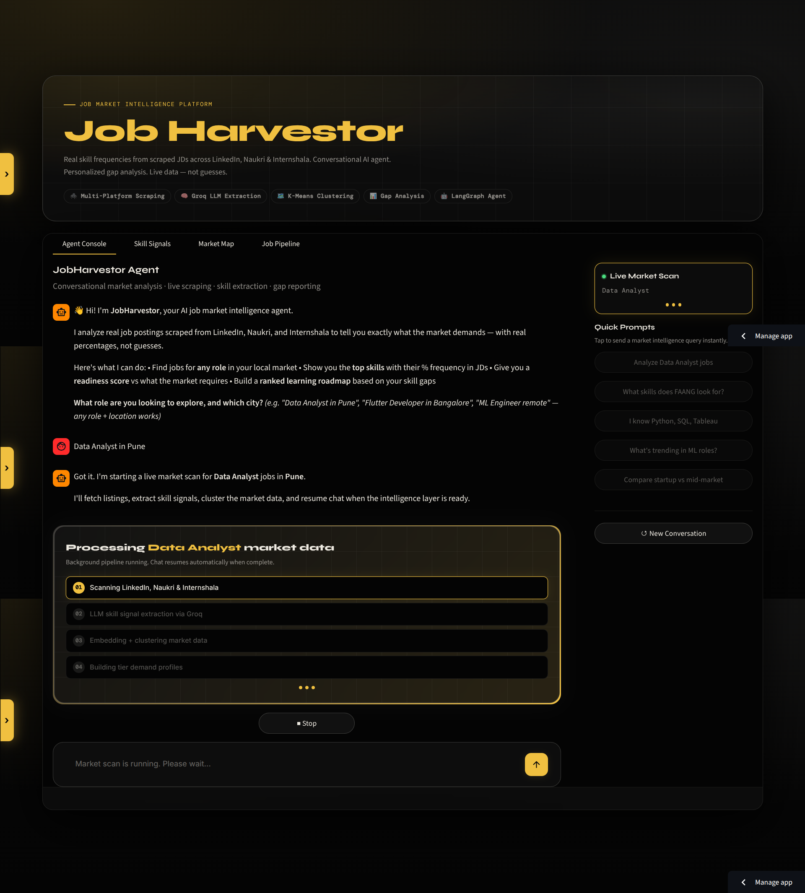
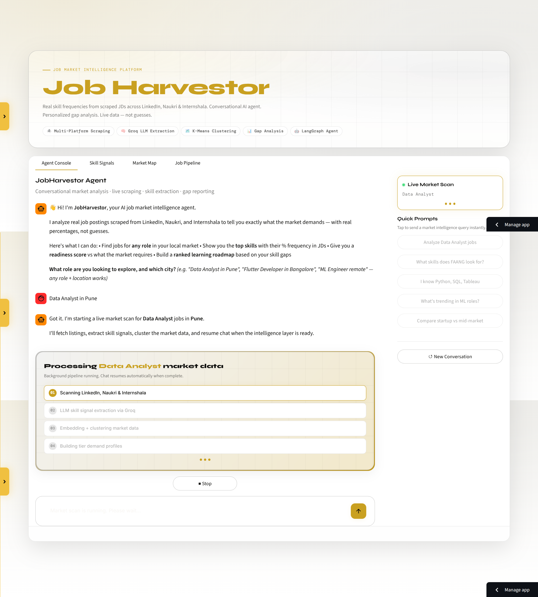
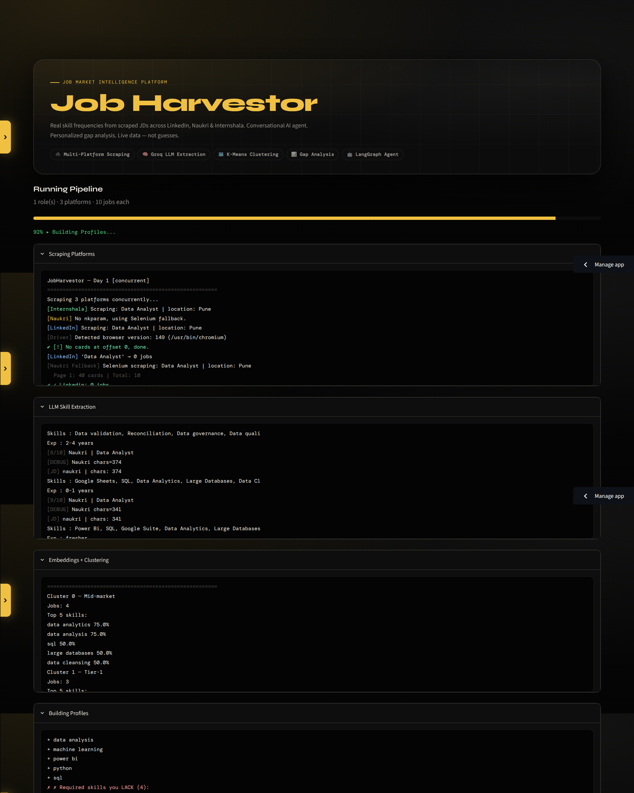
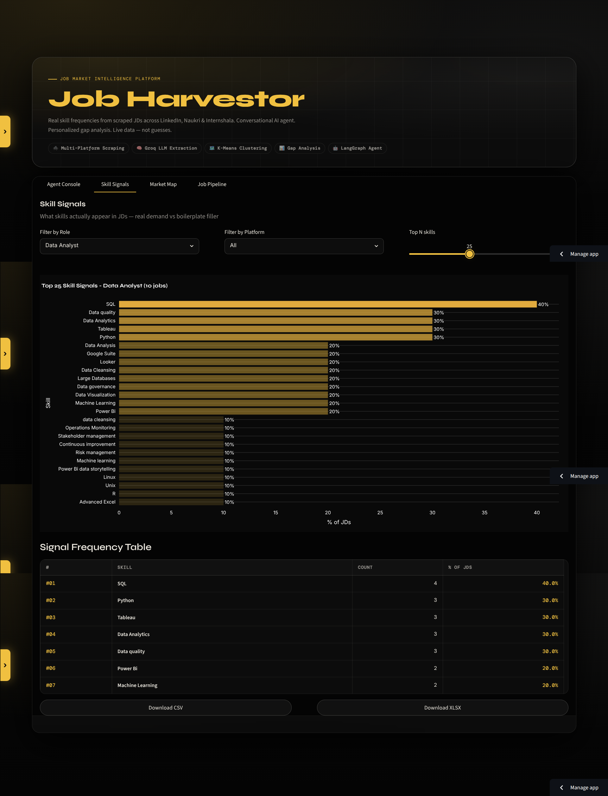
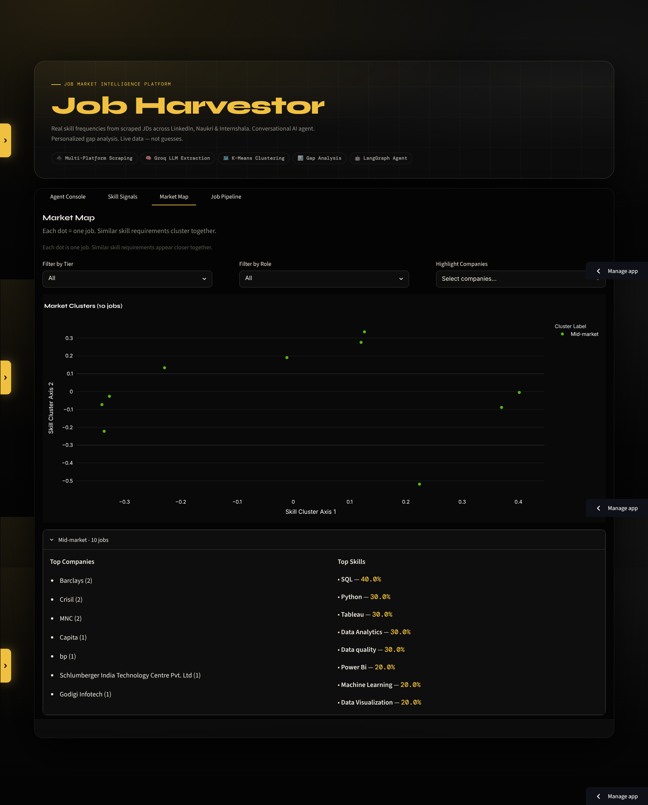
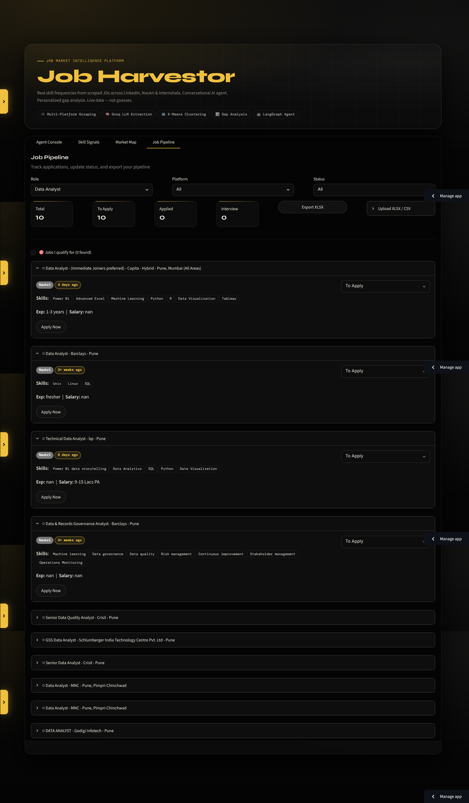

<div align="center">

# 🎯 JobHarvestor

### AI-powered job market intelligence
**Scrapes 600+ live JDs · Extracts skills via LLM · Clusters by company tier · Scores your readiness**

<br/>

<!-- Live Demo -->
[](https://jobharvestor.streamlit.app)

<br/>


---

> **70% of AI role JDs are inconsistent** — candidates spend 6–12 months learning wrong skills. JobHarvestor scrapes real postings across LinkedIn, Naukri and Internshala, extracts structured skill data via a Groq LLM pipeline, and clusters them by company tier (FAANG / Startup / Mid-market) to show you exactly what matters vs what's boilerplate filler — with a personalized readiness score and ranked learning roadmap. >

</div>

---

## 📸 Preview

<!-- Agent Console — full-width hero -->


---



<br/>

<table>
  <tr>
    <td width="50%">
      
      <p align="center"><sub><b>Agent Console</b> — conversational agent with which you can scrape+analyze</sub></p>
    </td>
    <td width="50%">
      
      <p align="center"><sub><b>Skill Signals</b> — top-N skills ranked by % frequency in JDs</sub></p>
    </td>
  </tr>
  <tr>
    <td width="50%">
      
      <p align="center"><sub><b>Market Map</b> — PCA scatter of jobs by skill similarity</sub></p>
    </td>
    <td width="50%">
      
      <p align="center"><sub><b>Job Pipeline</b> — application tracker with match scoring</sub></p>
    </td>
  </tr>
</table>

---

## 🧠 What It Does

Most job boards show you listings. JobHarvestor tells you what the market **actually demands** — with real percentages from scraped JDs, segmented by company tier.

| Capability | Details |
|---|---|
| **Multi-platform scraping** | LinkedIn (guest API), Naukri (Selenium + BS4), Internshala (requests + BS4) |
| **LLM skill extraction** | Full JD text → structured `required_skills`, `nice_to_have`, `experience`, `salary` via Groq |
| **Market segmentation** | `sentence-transformers` embeddings → K-Means clustering → Tier-1 / Startup / Mid-market |
| **Gap analysis** | Your skills vs market demand → readiness score (0–100%) + ranked learning roadmap |
| **Conversational agent** | LangGraph ReAct agent with 4 tools, multi-turn memory, live background scraping |
| **REST API** | FastAPI with `/analyze`, `/profiles`, `/skills/{tier}` endpoints |

---

## 🏗 Architecture

```
main.py          →  Scrape: LinkedIn · Naukri · Internshala  →  data/JobHarvestor.csv
                    Sequential by default; concurrent (ThreadPoolExecutor) when jobs/platform < 50
main2.py         →  Visit each job URL, extract full JD text
                    Groq LLM: required_skills[], nice_to_have[], experience, salary
                    ThreadPoolExecutor for LinkedIn + Internshala · Naukri sequential (shared browser)
                    Dual-key rotation + rate limiting → JobHarvestor.xlsx (4 sheets)
main3.py         →  sentence-transformers embeddings  (all-MiniLM-L6-v2)
                    K-Means clustering  (K=3 market tiers) · PCA → 2D scatter coordinates
                    Per-cluster skill frequency + relative tier differentiation
                    →  cluster_report.json
main4.py         →  Ground truth profiles per cluster (required ≥40% · useful 20–40%)
                    Gap analysis against your skills
                    →  ground_truth_profiles.json · my_gap_report.json
streamlit_app.py →  4-tab dashboard + LangGraph StateGraph conversational agent
api/main.py      →  FastAPI REST API
```

---

## 🖥 Dashboard — 4 Tabs

**Agent Console** — Conversational market intelligence. Type a role and city; the agent triggers a background pipeline scan, then walks you through skill signals and gap analysis in natural language.

**Skill Signals** — Plotly bar chart of top-N skills ranked by % frequency across all scraped JDs. Filter by role and platform. Export as CSV or XLSX.

**Market Map** — PCA scatter plot where each dot is one job. Similar skill profiles cluster together. Filter by tier, role, or highlight specific companies.

**Job Pipeline** — Full application tracker. Update status per listing (To Apply / Applied / Interview / Rejected / Offer), see your match score against your skills, export to XLSX.

---

## ⚡ Quick Start

```bash
# 1. Clone and install
git clone https://github.com/IamShariqMukadam/jobharvestor
cd jobharvestor
pip install -r requirements.txt

# 2. Configure environment
cp .env.example .env
# Fill in: GROQ_API_KEY=your_key
#          GROQ_API_KEY_2=your_second_key   (optional — doubles throughput)

# 3. Run the pipeline
python3 main.py       # Scrape jobs → CSV
python3 main2.py      # LLM skill extraction → XLSX
python3 main3.py      # Embeddings + clustering
python3 main4.py      # Profiles + gap analysis

# 4. Launch UI
streamlit run streamlit_app.py
```

> Everything in steps 3–4 can also be triggered directly from the Streamlit sidebar using the **Scrape Jobs + Analyze** button — no terminal needed.

---

## 🔧 Configuration

Edit `config.py` to set roles, locations, and scrape limits:

```python
ROLES = [
    "Data Analyst", "Data Scientist",
    "AI/ML Engineer", "Machine Learning Engineer",
]

TARGET_LOCATIONS = ["Pune", "Remote", "Hybrid"]

MAX_JOBS_PER_SEARCH = 50     # per role per platform

GROQ_MODEL = "llama-3.1-8b-instant"    # fast + free tier
# GROQ_MODEL = "llama-3.3-70b-versatile"  # higher quality
```

The Streamlit sidebar also supports live role and location configuration without editing any code.

---

## 📁 Project Structure

```
jobharvestor/
├── main.py                    # Day 1: Scraping runner
├── main2.py                   # Day 2: LLM extraction runner
├── main3.py                   # Day 3: Embeddings + clustering runner
├── main4.py                   # Day 4: Profiles + gap analysis runner
├── streamlit_app.py           # Dashboard + agent UI
├── config.py                  # All configuration
├── requirements.txt
├── packages.txt               # System packages (chromium, chromium-driver)
│
├── scrapers/
│   ├── linkedin.py            # Guest API scraper (no login required)
│   ├── naukri.py              # Selenium + BS4, Selenium fallback
│   ├── internshala.py         # requests + BS4 (fully static)
│   └── jd_scraper.py          # Per-platform full JD text extraction
│
├── llm/
│   └── extractor.py           # Groq extraction, dual-key rotation, rate limits
│
├── clustering/
│   ├── embedder.py            # sentence-transformers + disk cache
│   ├── clusterer.py           # K-Means (K=3) + PCA 2D reduction
│   └── analyzer.py            # Per-cluster skill frequency + tier labeling
│
├── analysis/
│   ├── gap_analyzer.py        # Readiness score, priority learning list
│   └── profile_builder.py     # Ground truth profiles from cluster data
│
├── agent/
│   ├── graph.py               # LangGraph StateGraph ReAct agent
│   ├── tools.py               # 4 agent tools (search, extract, cluster, gap)
│   └── state.py               # AgentState TypedDict
│
├── api/
│   ├── main.py                # FastAPI app with CORS
│   └── models.py              # Pydantic request/response models
│
└── utils/
    ├── driver.py              # Selenium WebDriver (auto-detects Chrome version)
    ├── exporter.py            # CSV + XLSX export with styling
    ├── humanize.py            # Anti-detection: human scrolls, random delays
    ├── session_store.py       # JSON-based session persistence
    └── cookies.py             # Browser cookie save/load utilities
```

---

## 🤖 Agent Tools

The LangGraph agent has four callable tools that wrap the existing pipeline logic:

| Tool | Purpose |
|---|---|
| `search_jobs_tool` | Searches `raw_jobs.csv` for a role + optional tier filter |
| `extract_skills_tool` | Returns aggregated skill frequency across all JDs for a role |
| `cluster_analysis_tool` | Returns the ground truth skill profile for a given tier |
| `gap_analysis_tool` | Compares user skills vs market demand → readiness score + roadmap |

---

## 🌐 REST API

```bash
# Start server
uvicorn api.main:app --reload --port 8000

# Explore interactive docs
open http://localhost:8000/docs
```

| Endpoint | Method | Description |
|---|---|---|
| `/health` | GET | Health check + loaded cluster count |
| `/profiles` | GET | All cluster ground truth profiles |
| `/skills/{tier}` | GET | Top skills for a given tier |
| `/analyze` | POST | Full gap analysis for user skills + target tier |

**Example request:**
```json
POST /analyze
{
  "user_skills": ["Python", "SQL", "Pandas", "Power BI"],
  "target_tier": "mid-market"
}
```

---

## 📊 Output Files

| File | Contents |
|---|---|
| `data/JobHarvestor.csv` | All scraped jobs with extracted skills, experience, salary |
| `data/JobHarvestor.xlsx` | 4-sheet Excel: All Jobs, Platform Breakdown, Skill Frequency, Gap Analysis |
| `data/cluster_report.json` | Per-cluster skill profiles with % frequency |
| `data/ground_truth_profiles.json` | Required (≥40%) vs useful (20–40%) skills per tier |
| `data/my_gap_report.json` | Personalized gap analysis output |
| `data/embeddings.npy` | Cached JD embeddings (auto-invalidates when job count changes) |

---

## 🛡 Reliability & Rate Limiting

- **Groq extraction** — `@sleep_and_retry` + `@limits(calls=15, period=60)` per key, dual-key rotation via `itertools.cycle`, `Retry-After` header respected on 429 responses
- **Checkpointing** — saves CSV progress every 25 rows; skips already-processed rows on restart
- **Background scraping** — file-based IPC (`.bg_running`, `.bg_done`, `.bg_phase`) keeps the UI responsive during long runs
- **Stop flag** — `scraping_stop.flag` halts scraping mid-run across all three platforms
- **Deduplication** — URL + Title + Company triple-key dedup at export
- **Browser detection** — `undetected_chromedriver` with auto-detected Chrome version, human-like scrolling and random delays to avoid bot detection

---

## 🧩 Tech Stack

| Layer | Technology |
|---|---|
| **Scraping** |     |
| **LLM Extraction** |   |
| **Embeddings** |  |
| **Clustering** |  |
| **Agent** |    |
| **UI** |   |
| **API** |   |
| **Data** |   |
| **Pipeline** |   |

---

## 🚀 Deployment Notes

- Set `CHROME_PATH` env var to point to your Chromium binary (defaults to `/usr/bin/chromium`)
- `packages.txt` installs `chromium` and `chromium-driver` on Streamlit Cloud automatically
- Each user session gets an isolated `data/sessions/{session_id}/` directory; sessions older than 24 hours are cleaned up automatically

---

<div align="center">

Built with Python · Selenium · Groq · LangGraph · sentence-transformers · Streamlit

</div>